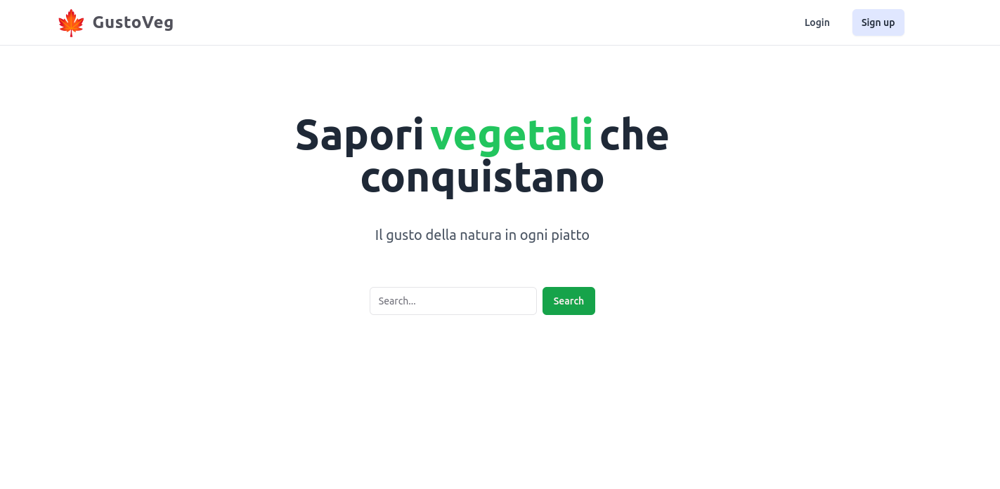

<a name="readme-top"></a>

<!-- PROJECT LOGO -->
<br />
<div align="center">
  <a>
    
  </a>

  <h3 align="center">Sapori vegetali che conquistano</h3>

  <p align="center">
    <br />
    <a href="https://github.com/giobn00/Vegetarian-Recipe-Website"><strong>Explore the docs »</strong></a>
    <br />
    <br />
    <a href="https://saporivegetalicheconquistano.giovannibono.com">View Demo</a>
    ·
    <a href="https://github.com/giobn00/Vegetarian-Recipe-Website/issues">Report Bug</a>
    ·
    <a href="https://github.com/giobn00/Vegetarian-Recipe-Website/pulls">Request Feature</a>
  </p>
</div>


<!-- TABLE OF CONTENTS -->
<details>
  <summary>Table of Contents</summary>
  <ol>
    <li>
      <a href="#about-the-project">About The Project</a>
      <ul>
        <li><a href="#built-with">Built With</a></li>
      </ul>
    </li>
    <li>
      <a href="#getting-started">Getting Started</a>
      <ul>
        <li><a href="#prerequisites">Prerequisites</a></li>
        <li><a href="#installation">Installation</a></li>
      </ul>
    </li>
    <li><a href="#contact">Contact</a></li>
  </ol>
</details>


<!-- ABOUT THE PROJECT -->
## About The Project
<div align="center">
  
</div>
This is vegetarian recipes web site, inside of it you'll have the possibility to search every vegetarian recipe you can think of.
<br/>
This site uses the API provided by the site spoonacular 


<p align="right">(<a href="#readme-top">back to top</a>)</p>


### Built With

* [![vite][vite]][vite-url]
* ![CSS][CSS.com]
* ![HTML][HTML.com]
* [![React][React.js]][React-url]
* ![NodeJS][NodeJS.org]
* ![WebPack][WebPack.com]
* [![shadcn][shadcn\ui]][shadcn-url]
* [![javascript][javascript.com]][javascript-url]
* [![ReactRouter][React Router]][React-Router-url]
* [![Tailwind][Tailwind]][Tailwind-url]
* ![gitignore][gitignore.com]

<p align="right">(<a href="#readme-top">back to top</a>)</p>

<!-- GETTING STARTED -->
## Getting Started

  To start you need a key from Spoonacular.This key is used in the enverorment file .env
  <br/>
  To get your own key you need to go to the site spoonacular and create an account.
  <br/>
  After you have your key you need to create a .env file in the root of the project

  Follow this <a href="https://spoonacular.com/food-api">Link</a>
  

### Prerequisites

To work the app need npm and Node.js run on the terminal 
* to see if we have npm
  ```sh
  npm -v
  ```
* to see if we have Node.js
  ```sh
  node -v
  ```

### Installation

_Below is an example of how you can instruct your audience on installing and setting up your app. This template doesn't rely on any external dependencies or services._

1. Get a free API Key at [https://spoonacular.com/food-api](https://spoonacular.com/food-api)
2. Clone the repo
   ```sh
   git clone https://github.com/giobn00/Progetto-React-di-Giovanni-Bono.git
   ```
3. Install NPM packages
   ```sh
   npm install react-router-dom
   ```
4. Enter your API_key in `.env`
   ```sh
   VITE_API_KEY = ThisIsMyKey
   ```
5. run the app
    ```sh
    npm run dev
    ```

<p align="right">(<a href="#readme-top">back to top</a>)</p>

<!-- CONTACT -->
## Contact

Giovanni Bono - [@portfolio](https://developer.giovannibono.com/) - me@giovannibono.com

Project Link: [saporivegetalicheconquistano.giovannibono.com](https://saporivegetalicheconquistano.giovannibono.com)

<p align="right">(<a href="#readme-top">back to top</a>)</p>

<!-- MARKDOWN LINKS & IMAGES -->
<!-- https://www.markdownguide.org/basic-syntax/#reference-style-links -->
[contributors-shield]: https://img.shields.io/github/contributors/othneildrew/Best-README-Template.svg?style=for-the-badge
[contributors-url]: https://github.com/othneildrew/Best-README-Template/graphs/contributors
[forks-shield]: https://img.shields.io/github/forks/othneildrew/Best-README-Template.svg?style=for-the-badge
[forks-url]: https://github.com/othneildrew/Best-README-Template/network/members
[stars-shield]: https://img.shields.io/github/stars/othneildrew/Best-README-Template.svg?style=for-the-badge
[stars-url]: https://github.com/othneildrew/Best-README-Template/stargazers
[issues-shield]: https://img.shields.io/github/issues/othneildrew/Best-README-Template.svg?style=for-the-badge
[issues-url]: https://github.com/othneildrew/Best-README-Template/issues
[license-shield]: https://img.shields.io/github/license/othneildrew/Best-README-Template.svg?style=for-the-badge
[license-url]: https://github.com/othneildrew/Best-README-Template/blob/master/LICENSE.txt
[linkedin-shield]: https://img.shields.io/badge/-LinkedIn-black.svg?style=for-the-badge&logo=linkedin&colorB=555
[linkedin-url]: https://linkedin.com/in/othneildrew
[product-screenshot]: images/screenshot.png
[React.js]: https://img.shields.io/badge/React-20232A?style=for-the-badge&logo=react&logoColor=61DAFB
[React-url]: https://reactjs.org/
[React Router]: https://img.shields.io/badge/React_Router-CA4245?style=for-the-badge&logo=react-router&logoColor=white
[React-Router-url]: https://reactrouter.com/en/main
[Tailwind]: https://img.shields.io/badge/Tailwind_CSS-38B2AC?style=for-the-badge&logo=tailwind-css&logoColor=white
[Tailwind-url]: https://tailwindcss.com/
[shadcn\ui]: https://img.shields.io/badge/shadcn%2Fui-000000?style=for-the-badge&logo=shadcnui&logoColor=white
[shadcn-url]: https://ui.shadcn.com/
[vite]: https://img.shields.io/badge/Vite-B73BFE?style=for-the-badge&logo=vite&logoColor=FFD62E
[vite-url]: https://vitejs.dev/
[javascript-url]: https://javascript.com
[javascript.com]: https://img.shields.io/badge/JavaScript-323330?style=for-the-badge&logo=javascript&logoColor=F7DF1E
[HTML.com]: https://img.shields.io/badge/HTML5-E34F26?style=for-the-badge&logo=html5&logoColor=white
[CSS.com]:https://img.shields.io/badge/CSS3-1572B6?style=for-the-badge&logo=css3&logoColor=white
[WebPack.com]: https://img.shields.io/badge/Webpack-8DD6F9?style=for-the-badge&logo=Webpack&logoColor=white
[gitignore.com]: https://img.shields.io/badge/gitignore%20io-204ECF?style=for-the-badge&logo=gitignoredotio&logoColor=white
[NodeJS.org]: https://img.shields.io/badge/nodejs-%2343853D.svg?style=for-the-badge&logo=node.js&logoColor=white